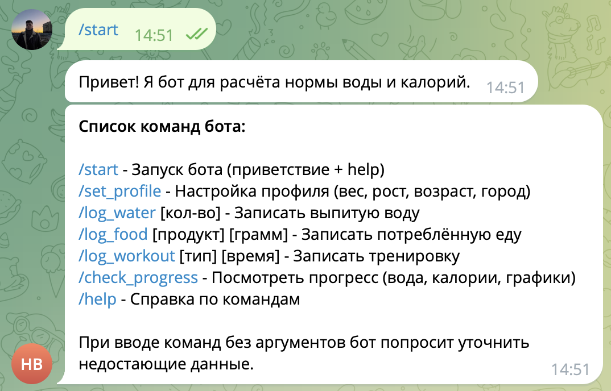
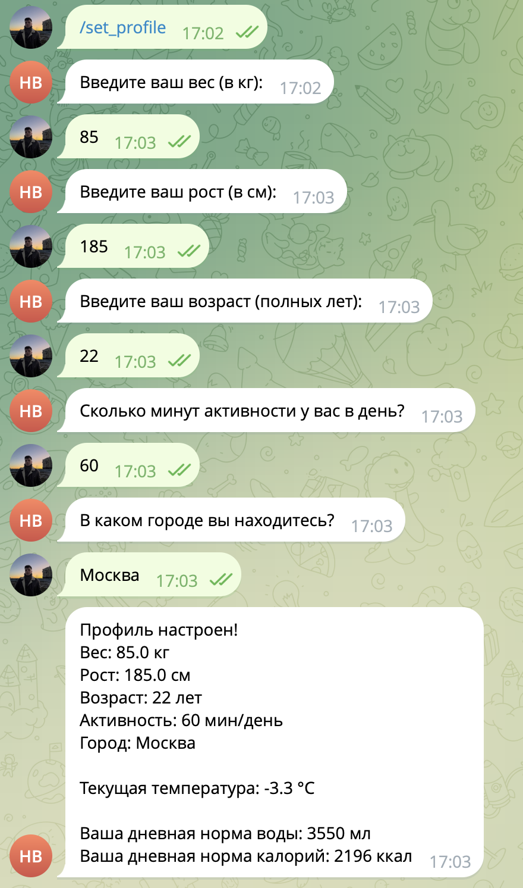
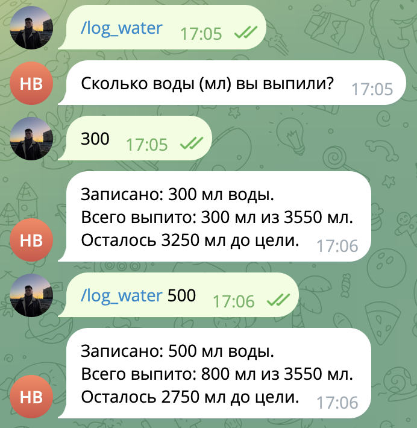
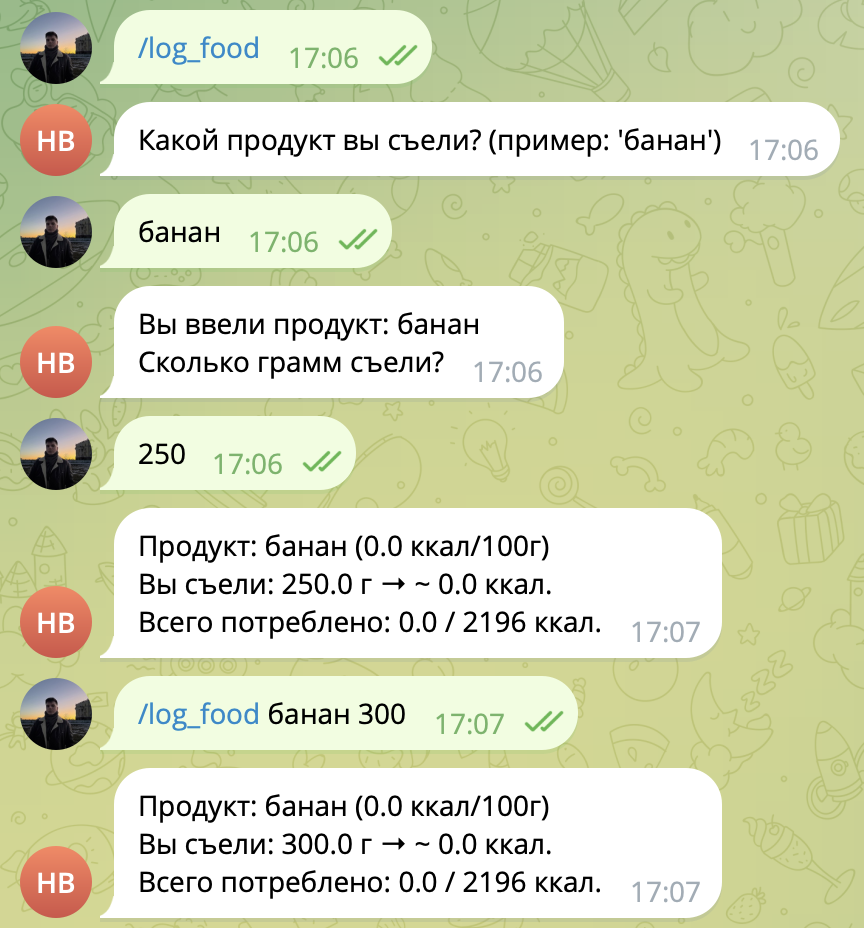
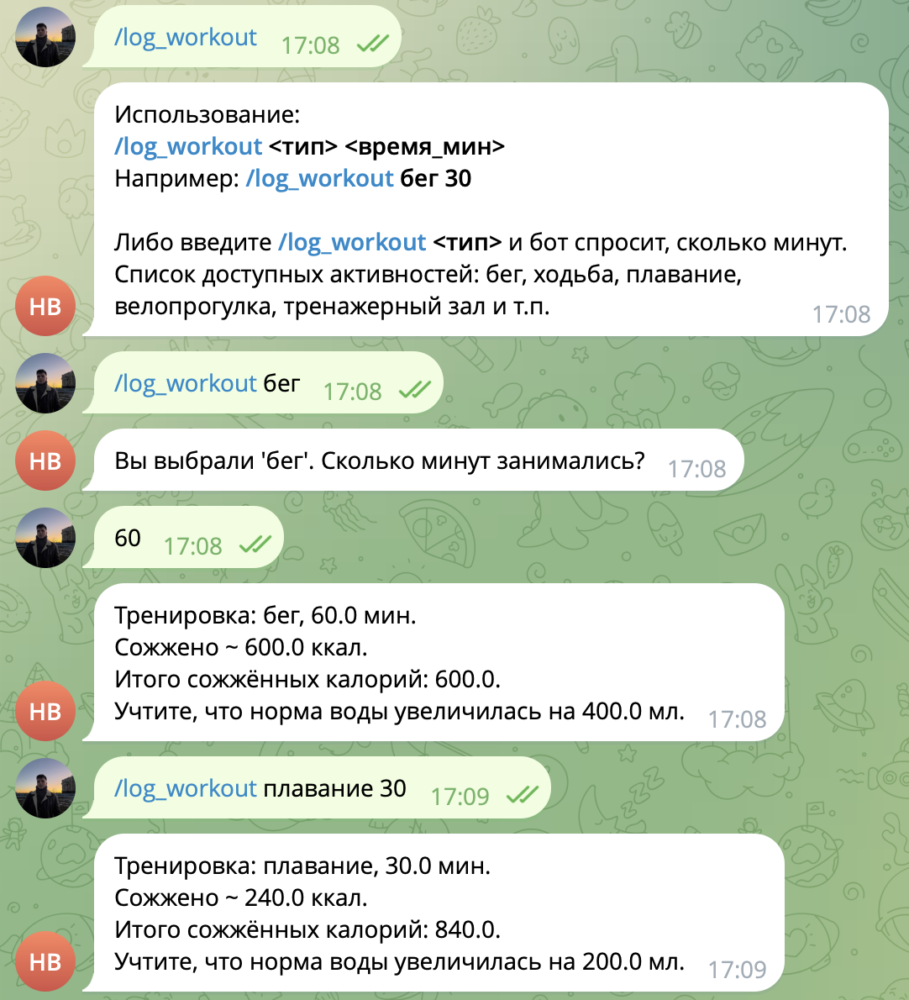
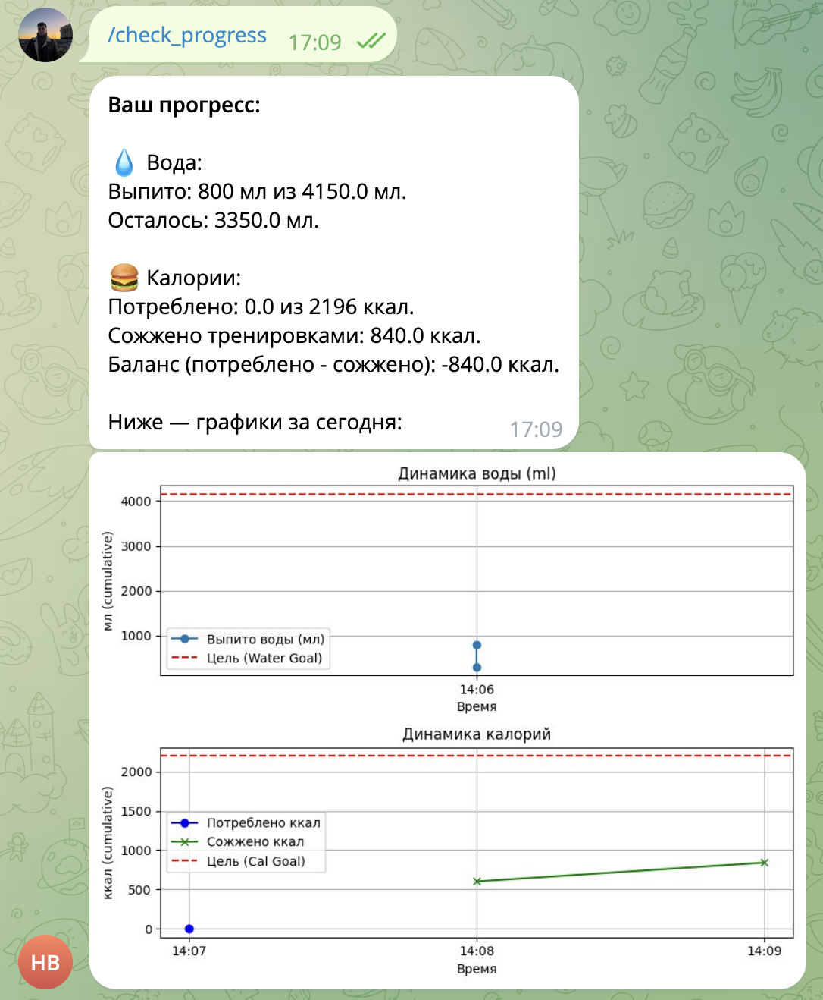

# Telegram-бот для расчёта нормы воды, калорий и трекинга активности

Проект deployed в <ins>**railway.com**</ins> по [этой ссылке](https://railway.com/project/8d7a9bc4-3567-4826-849d-ce0060abf768?environmentId=eaccdd2a-7f76-44dd-8202-50727eb02fd2) 

> Тут можно увидеть логи сборки и деплоя проекта. Когда проект активен, по telegram ссылке можно общаться с ботом, созданным специально для этого проекта


Бот написан на Python 3.11 (с использованием библиотеки [aiogram 3.x](https://docs.aiogram.dev/)) и предназначен для:

1. **Расчёта** дневной нормы воды и калорий, с учётом:
   - Параметров пользователя (вес, рост, возраст, уровень активности).
   - Текущей погоды (через [OpenWeatherMap](https://openweathermap.org/)).
   - Потребляемой еды (через [OpenFoodFacts](https://world.openfoodfacts.org/) или локальные данные).

2. **Трекинга**:
   - Воды (`/log_water`),  
   - Питания (`/log_food`),  
   - Тренировок (`/log_workout`).

3. **Показа прогресса** (`/check_progress`):
   - Графики накопленного потребления воды, калорий и сожжённых калорий.

Также бот:
- Реализует интерактивный диалог настройки профиля (`/set_profile`).  
- Позволяет просмотреть все доступные команды через `/help`.  

Все данные временно хранятся **в памяти** (глобальный словарь `users`), поэтому при перезапуске данные сбрасываются. При желании можно перейти на БД.

---

## Содержание

1. Демонстрация работы телеграм-бота
2. Установка и запуск локально
3. Использование
4. Окружение и переменные
5. Деплой через Docker
6. Структура проекта


---

## Демонстрация

Ниже несколько примеров взаимодействия с ботом:

### Пример 1: Настройка профиля

```text
Пользователь: /start
Бот: Привет! Я бот для расчёта нормы воды и калорий.
     ...
     (тут же выводится /help)

Пользователь: /set_profile
Бот: Введите ваш вес (в кг):
Пользователь: 70
Бот: Введите ваш рост (в см):
Пользователь: 175
Бот: Введите ваш возраст:
Пользователь: 25
...
(и так далее, после каждого шага идёт следующий вопрос)
```

Скриншоты:

1. Пример старта работы бота (и команды `/help`):



2. Пример создания профиля для трекинга и работы бота:



### Пример 2: Логирование воды, еды и тренировок

```text
Пользователь: /log_water 300
Бот: Записано: 300 мл воды.
     Всего выпито: 300 мл из 2400 мл.
     Осталось 2100 мл до цели.

Пользователь: /log_food банан
Бот: Вы выбрали продукт: банан
     Сколько грамм съели?
Пользователь: 150
Бот: Продукт: банан (89 ккал/100г)
     Вы съели: 150 г → ~133.5 ккал.
     Всего потреблено: 133.5 / 2500 ккал.

Пользователь: /log_workout бег 30
Бот: Тренировка: бег, 30 мин.
     Сожжено ~300.0 ккал.
     ...
```

Скриншоты:

1. Пример логирования воды:



2. Пример логирования еды (калорий) - может выдавать `0 калорий` в силу несовершентсва работы с [API OpenFoodFacts](https://world.openfoodfacts.org/cgi/search.pl):



3. Пример логирования тренировок:



### Пример 3: Прогресс и графики

```text
Пользователь: /check_progress
Бот: 
**Ваш прогресс:**

💧 Вода:
Выпито: 300 мл из 2400 мл.
Осталось: 2100 мл.

🍔 Калории:
Потреблено: 133.5 из 2500 ккал.
Сожжено тренировками: 300.0 ккал.
Баланс: -166.5 ккал.

(Затем бот присылает картинку с графиками)
```

Пример отслеживания прогресса:



## Установка и локальный запуск

1.	**Клонировать репозиторий**:

```bash
git clone git@github.com:DAChernikov/Health_checker_bot_telegram.git
cd Health_checker_bot_telegram
```

2. **Создать виртуальное окружение** (рекомендуется):

```bash
python -m venv venv
source venv/bin/activate    # Linux/Mac
# или venv\Scripts\activate # Windows
```

3. **Загрузить необходимые библиотеки и их зависимости:**

```bash
pip install -r requirements.txt
```

4. **Указать API-токен бота** (и ключ API от OpenWeatherMap (получать бесплатно)):
    * Либо вписать их в код/файл в места `YOUR_TELEGRAM_BOT_TOKEN_HERE` и `YOUR_API_FROM_OpenWeatherMap_HERE`;

    * Либо установить переменные окружения:

```bash
export BOT_TOKEN="Ваш_Токен_От_BotFather"
export OPENWEATHERMAP_API_KEY="Ключ_От_OpenWeatherMap"
```

5. **Запуск:**

```bash
python bot.py
```

6. **После запуска переходим к вашему телеграм-боту и начинаем общение**:

* `/start` → приветствие и список команд;
* `/set_profile` → настройка профиля и т.д.

## Использование

Ниже краткий список доступных команд (то же самое выводит /help в боте):
* `/start` – запуск бота (выводит приветствие и /help).
* `/help` – справка со всеми командами.
* `/set_profile` – пошаговая настройка профиля (вес, рост, возраст, активность, город).
* `/log_water [кол-во]` – логировать воду. Без аргументов бот спросит количество.
* `/log_food [продукт] [грамм]` – логировать еду. Без аргументов бот спросит продукт и вес.
* `/log_workout [тип] [время_мин]` – логировать тренировку (например, «бег 30»). Без аргументов бот выведет подсказку.
* `/check_progress` – показать текущий прогресс (кол-во воды, калорий, баланс) и отправить графики.

### Окружение и переменные
* `BOT_TOKEN` – токен вашего Телеграм-бота (полученный у `@BotFather`).
* `OPENWEATHERMAP_API_KEY` – ключ для OpenWeatherMap, чтобы бот мог запрашивать текущую температуру с сайта https://openweathermap.org.

Если эти переменные не заданы, в коде можно прописать значения по умолчанию. Но желательно хранить токен и ключи в окружении, чтобы не светить их в репозитории.

## Deploy with Docker

Пример `Dockerfile` в репозитории:

```dockerfile
FROM python:3.10

WORKDIR /app

COPY requirements.txt requirements.txt
RUN pip install --no-cache-dir -r requirements.txt

COPY . .

CMD ["python", "bot.py"]
```

1. **Локальная сборка и запуск**

* Cборка:

```bash
docker build -t my_telegram_bot .
```

* Запуск:

```bash
docker run -it --rm \
    -e BOT_TOKEN="Ваш_Токен_От_BotFather" \
    -e OPENWEATHERMAP_API_KEY="Ключ_От_OpenWeatherMap" \
    --name my_bot_container \
    my_telegram_bot
```

Так работа бота будет производиться через Docker-контейнер, в нем же можно будет отслеживать логи работ всех комманд, посылаемых пользователем боту через Телеграмм.

## Структура проекта:

```text
Health_checker_bot_telegram/
├─ bot.py                        # Точка входа. Запускаем "python bot.py"
├─ data/
│   ├─ __init__.py
│   └─ users_data.py             # Глобальный словарь users
├─ handlers/
│   ├─ __init__.py              # Регистрируем все хендлеры
│   ├─ help.py                  # /help
│   ├─ profile.py               # /set_profile и /start
│   ├─ log_water.py             # /log_water
│   ├─ log_food.py              # /log_food
│   ├─ log_workout.py           # /log_workout
│   └─ check_progress.py        # /check_progress (+ графики)
├─ services/
│   ├─ __init__.py
│   ├─ weather.py               # Функция get_temperature(...)
│   ├─ calculations.py          # Функции calc_water_goal(...), calc_calorie_goal(...)
│   ├─ food_api.py              # Функция get_food_kcal(...) (OpenFoodFacts)
│   └─ plots.py                 # Генерация графиков matplotlib
├─ requirements.txt             # aiogram, requests, matplotlib и пр.
└─ Dockerfile                   # Для деплоя в Docker
```
